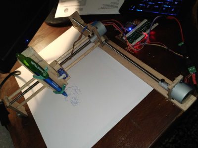
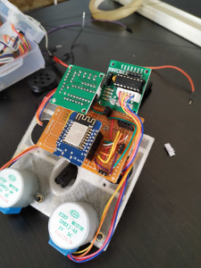
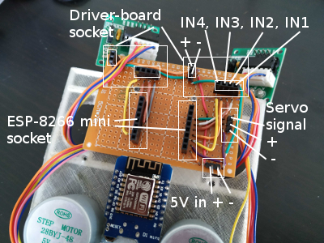

# ESP-8266 restful 2D pen plotter

### Hardware:
- 1 x NodeMCU 12e (ESP8266, I used a mini)
- 2 x step motor 28BYJ-48
- 1 x Servo SG90
- a pen
- rubber band

### Software:
**You need a [rest-api plugin for your browser](https://github.com/RESTEDClient/RESTED) or a tool like [postman](https://www.getpostman.com/)!**
- Arduino IDE
- gimp
- node.js

#### Libraries
- ArduinoJson
- AccelStepper

These are standard libs from Arduino and have just to be added and installed. 

## What happens until now:

### Spawns own WiFi when no WiFi is reachable. 
 - you can enter your own WiFi parameter. Just POST a json  to the server.
 - Default IP from own **Accespoint 192.168.0.1**
 - Your uploaded WiFI credentials are stored in a persistant config.json

### Plotter-ui to upload SVG files
- Integrated in /data folder.
- Plots the path of *gimp*-svg or *Inkscape*
- Documentation HowTo create Plotter-SVGs at [Plotter-UI](https://github.com/ivosdc/plotter-ui) on github.

(Powered by [Svelte](https://svelte.dev))

### Soldering

